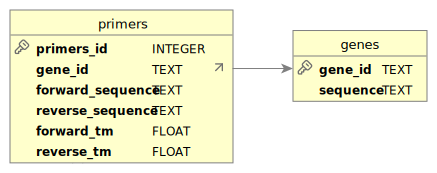

# DB Primers

This project focuses on foundational database concepts and practical implementations, developed as part of the SPbU curriculum. It serves as a resource for learning, experimenting, and researching database systems.

## Project Overview

- **Purpose**: To provide a hands-on approach to understanding database principles.
- **Technologies**: SQL, database modeling, and performance optimization.
- **Contributions**: Contributions are encouraged to expand and improve the project.

## Getting Started

### 1. Clone the repository:
```bash
git clone https://github.com/vladissta/DB_primers.git
cd DB_primers
```

### 2. Set environment

via *conda*
```bash
conda env create -f environment.yml
```

via *pip*
```
pip install -r requirements.txt
```

### 3. Run the application
```bash
python3 app/app.py
```

## Database Schema

Below is the visual representation of the database schema:

